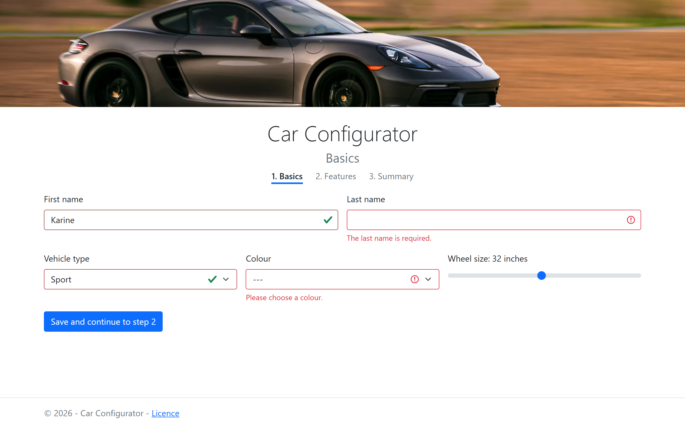
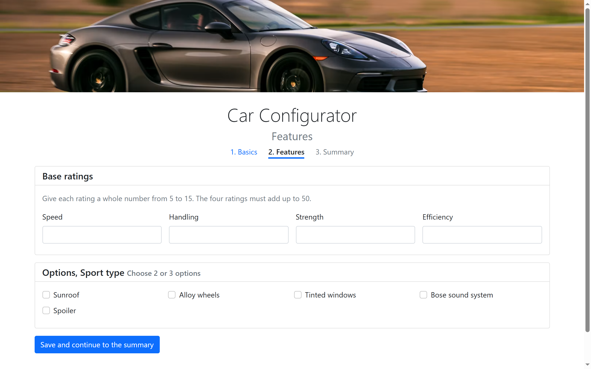
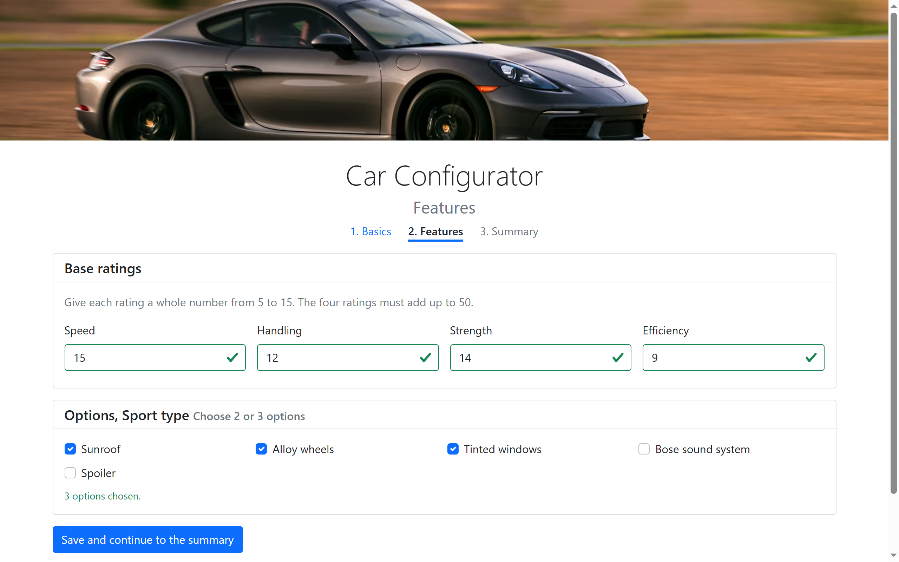
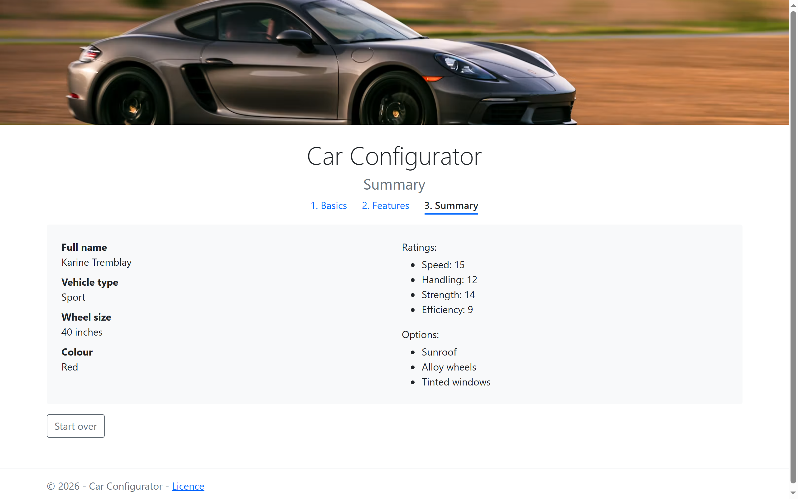
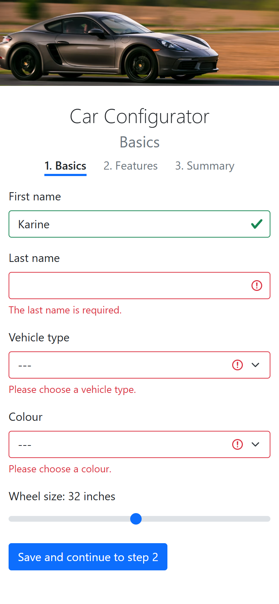

# car-configurator

A three-step form to configure a car: who you are, the vehicle type, its
colour and wheel size; then four ratings that must add up to fifty and two
or three options from the list of that type; then the summary. Every step
is checked before the next one opens, the errors show all at once on
submit and clear one by one as they are fixed, and what you entered
follows you from page to page.

HTML, Bootstrap 5 and plain JavaScript, no framework, no build step, named
functions only.

## Screenshots












## How it works

**One shared script, one page script per step.** `js/car.js` holds the
catalogue of vehicle types (label, colours, options) and the car being
built, saved in `sessionStorage` under one key; `js/validation.js` holds
the three marks a field can take, Bootstrap's `is-invalid` with its red
message, `is-valid`, or none. `step1.js`, `step2.js` and `step3.js` do
the rest, each loaded after the shared scripts.

**Validation in two stages, no browser bubbles.** Each form carries
`novalidate`, so the browser's own bubbles never show. On submit every
check runs and every error appears at once; from that moment each field is
checked again as soon as it changes, so a corrected field turns green
while the others stay red. Before the first submit nothing is marked.

**The colours follow the type.** Choosing a type rebuilds the colour list
from the catalogue; a colour that no longer exists is dropped, one that
still exists is kept.

**The options are built, not hidden.** Step 2 reads the type saved at
step 1, writes it in the title, and creates one checkbox per option of
that type with `createElement`. The four ratings must each be a whole
number from 5 to 15 and add up to exactly 50; that total, like the count
of two or three options, is checked under its group since no single field
is at fault.

**No step without the ones before.** Step 2 and step 3 ask for the saved
car and send the visitor back to step 1 when it is missing or incomplete.
Going back to an earlier step finds the fields filled in; Start over
clears everything.

## Running it

Open `index.html` in a browser, or serve the folder:

```bash
python -m http.server 8000
```

## Résumé

Un formulaire en trois pages pour configurer une voiture : identité, type
de véhicule, couleur et grosseur des roues ; puis quatre caractéristiques
dont la somme doit faire 50 et deux ou trois options propres au type ; puis
le résumé. Chaque page est validée avant de passer à la suivante : toutes
les erreurs apparaissent à la soumission, en rouge, et chacune disparaît
dès qu'elle est corrigée, avec un encadré vert. Les couleurs dépendent du
type, les options sont créées dynamiquement selon le type, les données
passent d'une page à l'autre par `sessionStorage`. HTML, Bootstrap 5 et
JavaScript natif, fonctions nommées uniquement.

## Licence

MIT. See [LICENSE](LICENSE). The banner is a public photo on
[Unsplash](https://unsplash.com/license), linked by URL.
